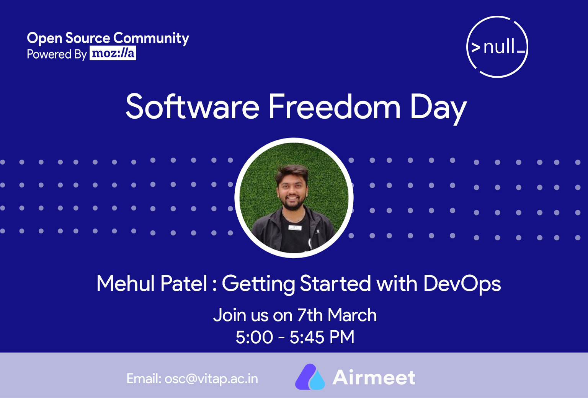

#  Software Freedom Day 2021

**About webinar** : Team of Open Source Community from VIT-AP celebrating Software Freedom Day on the 7th of March, 2021. My session was on the prospects of working with DevOps and getting your feet wet with CI/CD.

### Talk Details 

* **Title**: Getting Started with DevOps 
* **Talk Abstract**: In this session, I will share the beginner guide to DevOps and the tools that are useful to start their first contribution. 
* **Date**: 7th March 2021
* **Time**: 04.00 PM to 06.00 PM
* **Online**: https://www.runtheworld.today/app/invitation/19612

Special thanks to [Open Source Community: VIT-AP](https://www.linkedin.com/company/oscvitap/) for hosting me.

#### Event type: Public

Feel free to ping me anytime on [Telegram](http://telegram.me/rowdymehul) or [Twitter](http://twitter.com/rowdymehul) and I’m happy to chat with you.

For any queries raise a [issue](https://github.com/rowdymehul/SecurityVue-India-Webinar/issues) and please feel free to submit a PR anytime :)

